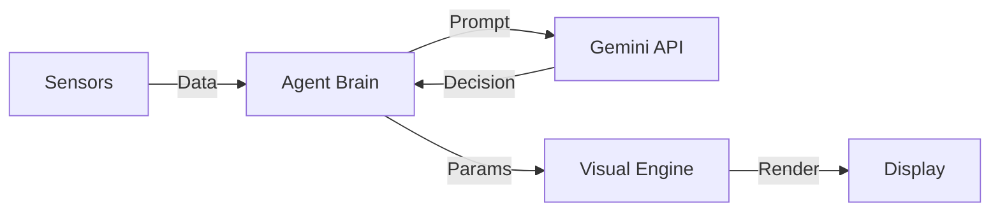

# 🌌 Agentic AI Screensaver

> An autonomous, self-adaptive screensaver that generates evolving visuals and poetry based on your system's mood.


The **Agentic AI Screensaver** is not just a loop of video; it's a living system. It observes your computer's state (CPU load, RAM usage, time of day) and uses a Large Language Model (Google Gemini) to decide on an artistic direction. 

Is your CPU overheating from a compile job? The screensaver might show a "Digital Storm" with chaotic rain and aggressive red hues. Is it late at night? It might shift to a "Deep Sleep" mode with calming blue gradients, drifting stars, and a soothing quote rendered in an elegant script font.

## ✨ Features

- **🧠 Agentic Core:** Powered by Google's Gemini LLM to make creative decisions about theme, color, and mood.
- **🎨 Atmospheric Visuals:** Procedural generation of gradients and organic particle effects (Rain, Snow, Fireflies, Stars, Fog).
- **📝 Dynamic Typography:** Automatically selects fonts (`Dancing Script`, `Merienda`, `Playfair Display`) that match the current aesthetic.
- **🖥️ System Sensing:** Reacts to real-time system metrics (CPU, RAM) and time of day.
- **🚀 Linux Native:** Includes a robust idle-detection script for automatic activation on Linux systems.
- **🛡️ Robust Design:** Features fallback "Mock Modes" and safe rendering to ensure it never crashes, even without internet.

## 🛠️ Architecture

The system follows an **Observe-Think-Act** loop:

1.  **Observe:** Sensors collect system telemetry.
2.  **Think:** The Brain module constructs a prompt and queries the LLM for a creative direction (Theme, Weather, Poetry, Font).
3.  **Act:** The Visual Engine renders the scene using Pygame and Freetype.



## 🚀 Installation

### Prerequisites
- Python 3.10 or higher
- A Google Gemini API Key (Get one [here](https://aistudio.google.com/))
- Linux (for automatic idle detection)

### Setup

1.  **Clone the repository:**
    ```bash
    git clone https://github.com/yourusername/agentic-screensaver.git
    cd agentic-screensaver
    ```

2.  **Install dependencies:**
    ```bash
    pip install -r AgenticScreensaver/requirements.txt
    ```
    *Note: On Linux, you also need `xprintidle` for auto-start:*
    ```bash
    sudo apt-get install xprintidle
    ```

3.  **Configure API Key:**
    ```bash
    export GEMINI_API_KEY="your_api_key_here"
    ```

## 🎮 Usage

### Manual Run
To test the screensaver immediately:
```bash
python3 AgenticScreensaver/main.py
```

### Automatic Mode (Linux)
To run it as a background daemon that activates after inactivity:
```bash
./run_screensaver.sh &
```
*Default idle threshold is **15 minutes**. You can edit `run_screensaver.sh` to change this.*

## 📂 Project Structure

```
.
├── AgenticScreensaver/
│   ├── agent/           # Logic (Brain, Sensors, Memory)
│   ├── visualizer/      # Rendering (Engine, Art Generator)
│   ├── assets/          # Fonts and resources
│   └── main.py          # Entry point
├── run_screensaver.sh   # Linux deployment script
└── requirements.txt     # Python dependencies
```

## 🤝 Contributing

Contributions are welcome! Please feel free to submit a Pull Request.

## 📄 License

This project is licensed under the MIT License - see the [LICENSE](LICENSE) file for details.
